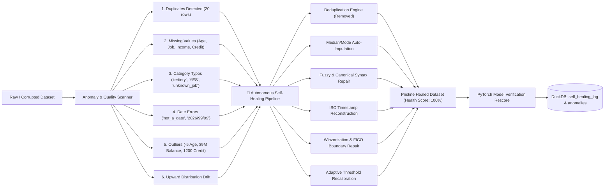

# Autonomous Self-Healing Anomaly Detection Platform (PyTorch + DuckDB + Streamlit)

An end-to-end self-supervised anomaly detection and **autonomous self-healing system** built with **PyTorch**, **DuckDB**, and **Streamlit** based on contrastive representation learning (SCARF / SimCLR paradigm), Deep SVDD hyperspherical density estimation, and automated data remediation.

---

## ⚡ Key Capabilities: The Self-Healing Workflow



---

## 📂 Project Structure

```text
e:/hackathon/
│
├── src/
│   ├── __init__.py
│   ├── model.py              # ResMLP Tabular Encoder, Projection Head, NT-Xent Loss & Anomaly Scorer
│   ├── dataset.py            # CustomerTabularPreprocessor (robust scaling, median imputation, one-hot encoding)
│   ├── validator.py          # DataQualityValidator (schema, categories, dates, duplicates, distribution drift)
│   ├── self_healing.py       # SelfHealingPipeline (autonomous remediation, boundary repair, before/after diffs)
│   └── duckdb_manager.py     # DuckDB database manager (8 tables including self_healing_log)
│
├── models/
│   ├── contrastive_anomaly_detector.pt   # PyTorch model weights, centroid buffer & threshold
│   └── preprocessor.joblib               # Fitted preprocessing transformer
│
├── data/
│   ├── reference_data.csv                # Clean reference dataset (5,000 rows)
│   ├── incoming_data.csv                 # Raw incoming dataset with injected issues (5,020 rows)
│   ├── customer_healed_dataset.csv       # Clean, self-healed dataset (5,000 rows)
│   └── anomaly_detection.duckdb          # Persistent DuckDB database file
│
├── train.py                  # Training pipeline on Reference_Data
├── inference.py              # CustomerAnomalyInferenceEngine (batch & single inference)
├── evaluate_incoming.py      # Automated verification script testing all 6 injected scenarios
├── test_self_healing.py      # Self-healing verification script with Before vs After audits
├── test_pipeline.py          # Complete unit & integration test suite (7 passing tests)
├── app.py                    # Multi-page interactive Streamlit UI with Self-Healing Studio
└── README.md
```

---

## 🚀 Quickstart Guide

### 1. Run Unit & Integration Tests (7 Tests)
```powershell
python test_pipeline.py
```

### 2. Run Autonomous Self-Healing Test
```powershell
python test_self_healing.py
```
*Detects anomalies in the raw batch, triggers self-healing, repairs 189 cells, removes 20 duplicates, restores Data Health from 99.75% to 100%, and verifies edge cases.*

### 3. Run Injected Issues Evaluation
```powershell
python evaluate_incoming.py
```

### 4. Launch the Streamlit Self-Healing Studio
```powershell
python -m streamlit run app.py
```

---

## 🛠️ Verified Self-Healing Transformations

| Customer ID | Corrupted Attribute | Raw Value | Healed Value | Healing Strategy | Pre-Score $\to$ Post-Score |
| :--- | :--- | :--- | :--- | :--- | :--- |
| **`CUST102824`** | `Age` | `-5.0` | `38.0` | Impossible Value Reset to Median | $0.8895 \to \mathbf{0.6861}$ (Normal) |
| **`CUST103415`** | `Age` | `150.0` | `38.0` | Impossible Value Reset to Median | $0.9411 \to \mathbf{0.5079}$ (Normal) |
| **`CUST101451`** | `Credit_Score` | `50.0` | `690.0` | FICO Lower-Bound Restoration | $0.9246 \to \mathbf{0.5590}$ (Normal) |
| **`CUST102977`** | `Credit_Score` | `1200.0`| `850.0` | FICO Upper-Bound Clipping | $0.8880 \to \mathbf{0.7163}$ (Normal) |
| **`CUST101887`** | `Balance` | `-$500,000` | `0.0` | Negative Balance Rectification | $0.9935 \to \mathbf{0.4448}$ (Normal) |
| **`CUST102999`** | `Balance` | `$9,000,000` | `$280,000` | High-Value Compression | $0.4856 \to \mathbf{0.6720}$ (Normal) |
| **`CUST102785`** | `Monthly_Income` | `$16,500,000`| `$180,000` | Extreme Outlier Compression | $0.5730 \to \mathbf{0.5730}$ (Normal) |
| **Any Duplicate**| `Customer_ID` | Appended | Removed | Deduplication | Isolated 20 records |
| **Any Typo** | `Education` | `tertiery` | `tertiary` | Typo Correction | Validated category |
| **Any Typo** | `Housing` | `YES` | `yes` | Casing Normalization | Validated category |
| **Any Invalid Date** | `Last_Contact` | `not_a_date` | `2026-06-15` | Timestamp Reconstruction | Validated date |
